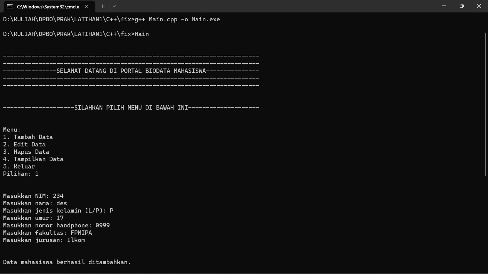
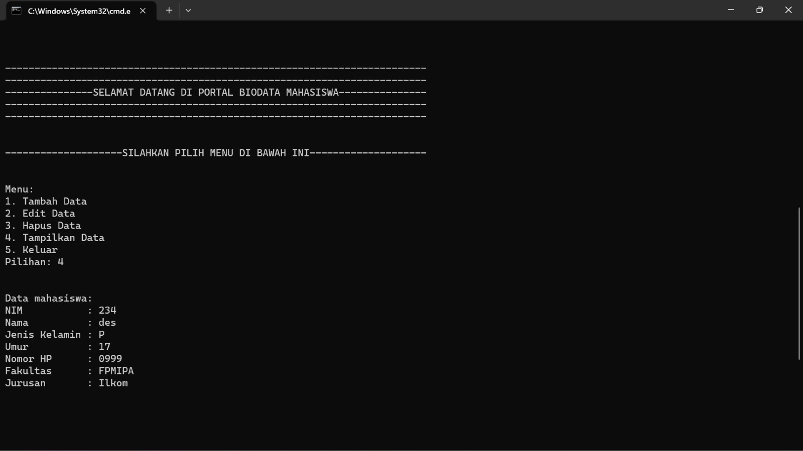
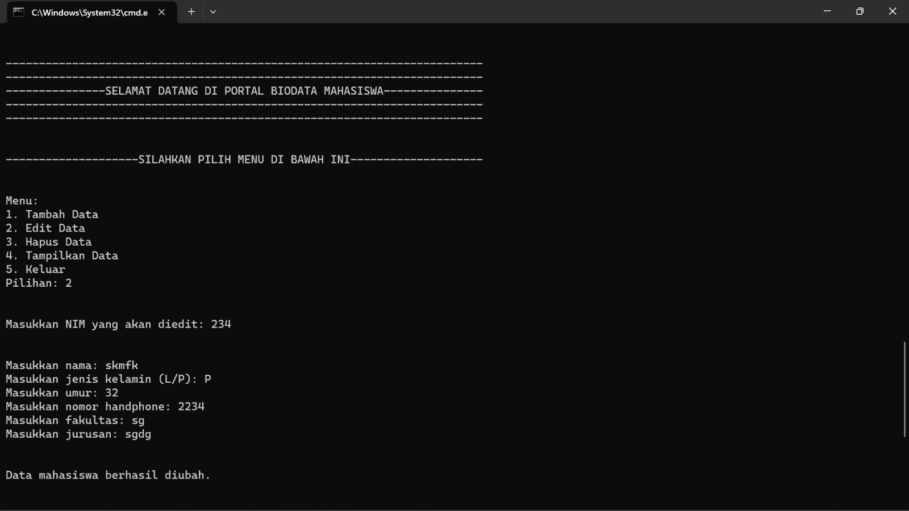
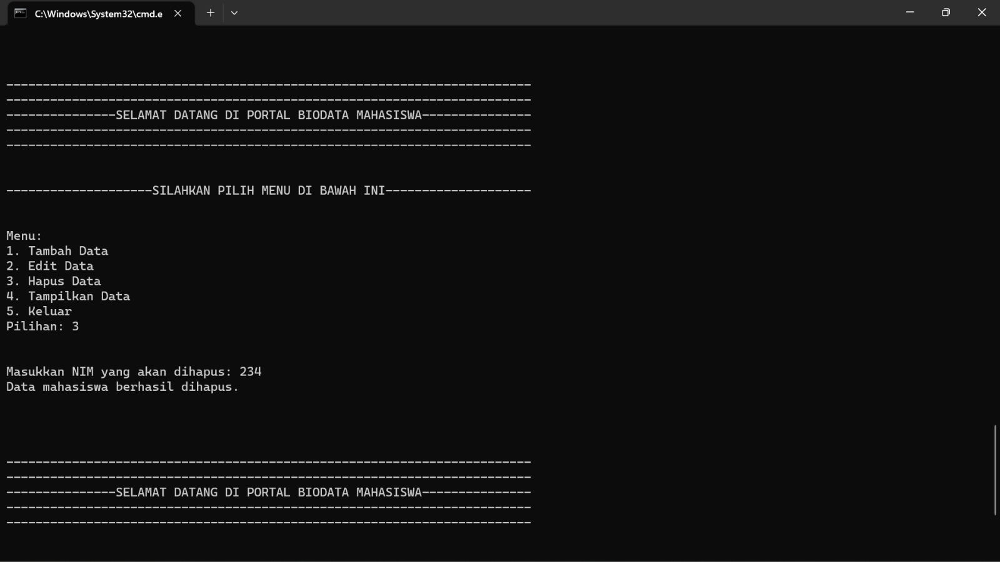
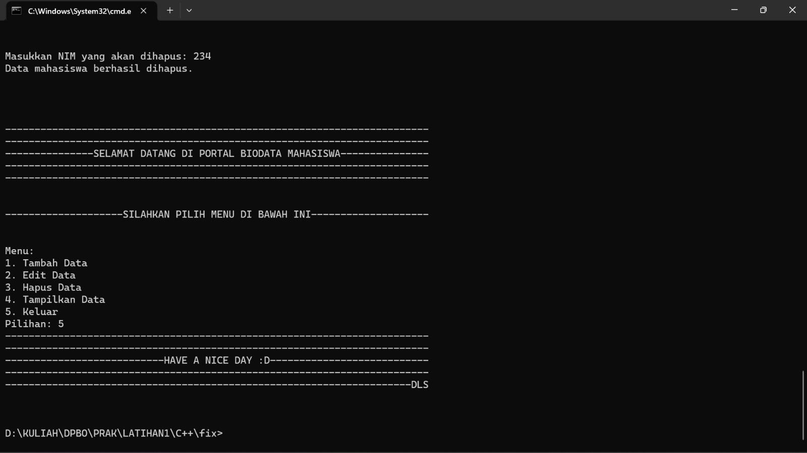

# LATIHAN1DPBO2023
## Janji
Saya Destira Lestari Saraswati NIM 2100506 mengerjakan soal Latihan 1
dalam mata kuliah Desain Pemrograman Berorientasi Objek untuk keberkahanNya
maka saya tidak melakukan kecurangan seperti yang telah dispesifikasikan.
Aamiin.

# Tugas LATIHAN1DPBO2023
Buatlah program berbasis OOP menggunakan bahasa pemrograman C++, Java,
Python, dan PHP yang menampilkan informasi daftar mahasiswa (sekumpulan
objek mahasiswa) dan memiliki fitur menambah, mengubah, dan menghapus data.
Setiap mahasiswa memiliki data nama, NIM, program studi, fakultas, dan foto profil
(khusus bahasa PHP).

File README berisi desain program, penjelasan alur, dan dokumentasi saat program dijalankan (screenshot/screen record, pilih salah satu bahasa sebagai contoh)

Submit link repository pada form berikut: [Form Pengumpulan]https://forms.gle/rvb1hKxbQVuYNbhKA 

## Desain Program
untuk program bahasa C++, JAVA, PHP, dan Python
Desain yang saya buat menggunakan 1 Class:
* Mahasiswa
Dengan tambahan file Main

`Class Mahasiswa` memiliki total tujuh atribut:
 
* **NIM** -> NIM, `string`
* **Nama** -> nama, `string`
* **Umur** -> umur, `Int`
* **Jurusan** -> jurusan, `string`
* **jenis_kelamin** -> jenis kelamin, `char`
* **no_hp** -> no_hp, `string`
* **fakultas** -> fakultas, `string`

_Semua Class diatas dilengkapi dengan setter dan getternya_

_Khusus php menggunakan file tambahan, yakni `tampil.php` untuk menampilkan data dalam table, dan `index.html` untuk menyediakan form inputan_

## Alur Program
C++, JAVA, Python:
-user memilih nomor menu yang disediakan
terdapat 5 menu yakni:
`1. Tambah Data`
`2. Edit Data`
`3. Hapus Data`
`4. Tampilkan Data`
`5. Keluar`
-menu 1: user dapat langsung memasukan data mahasiswa
-menu 2: user mengedit data mahasiswa berdasarkan nim
-menu 3: user menghapus data mahasiswa berdasarkan nim
-menu 4: data yang telah dimasukan akan ditampilkan seluruhnya dalam bentuk list vertical

-program akan terus menampilkan menu sampai user memilih menu 5

-terkecuali php hanya menginput, menambah, dan menampilkan data mahasiswa

## Dokumentasi
**Program C++**

